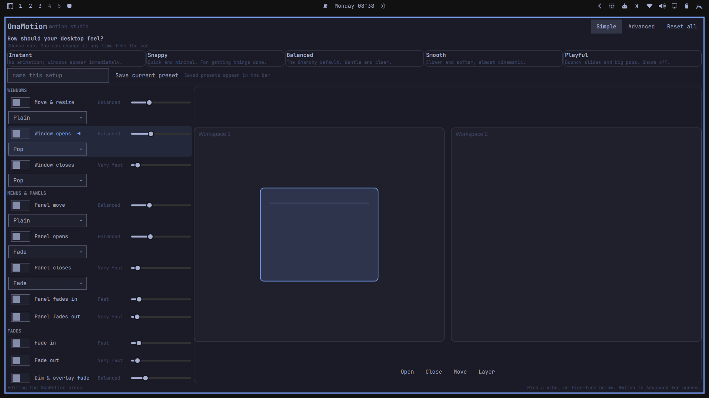
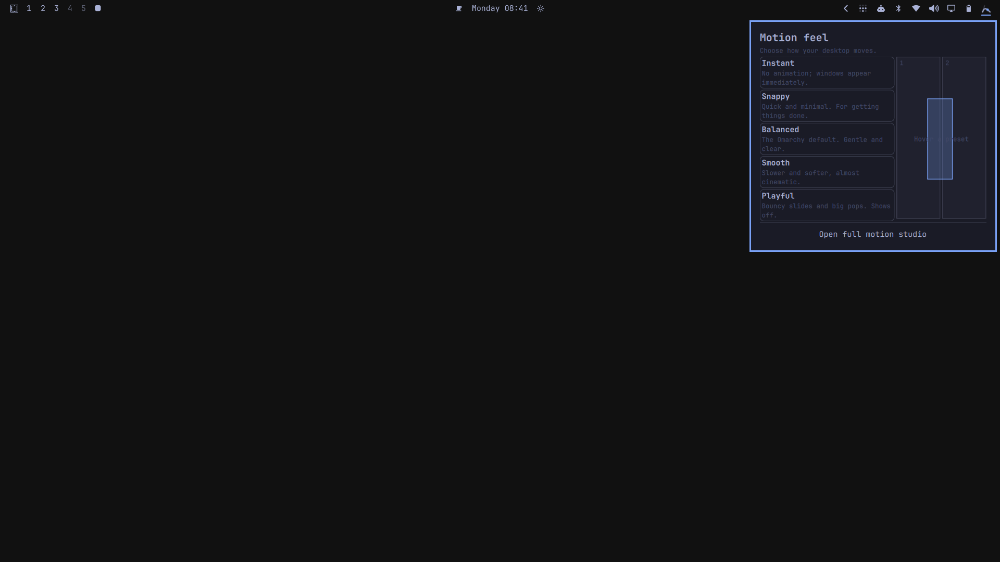

# OmaMotion

OmaMotion is an Omarchy shell plugin for editing Hyprland animation settings.
It provides a preset picker, a simple editor, an advanced editor, a curve
editor, and a live preview.




## Install

```bash
omarchy plugin add https://github.com/cgaray/omarchy-omamotion.git --enable --yes
```

Open OmaMotion from the application menu or bind it directly:

```lua
o.bind("SUPER + SHIFT + M", "OmaMotion", "omarchy-shell shell toggle io.github.cgaray.omamotion")
```

Remove it with:

```bash
omarchy plugin remove io.github.cgaray.omamotion --yes
```

The plugin does not change Hyprland configuration during removal. Use **Reset
all** first to remove OmaMotion's managed animation block.

## Bar Picker

The bar widget provides the Instant, Snappy, Balanced, Smooth, and Playful
presets. Click a preset to apply it. Right-click the widget to open the studio.
Saved custom presets are also available in this menu.

For a manual installation, enable the widget with:

```bash
omarchy plugin enable io.github.cgaray.omamotion right
```

## Editors

Simple mode uses labels such as Window opens, Panel fades out, Fast, and Slide.
Advanced mode exposes every animation leaf, curve selection, raw style tokens,
and custom curves.

The preview supports window and layer open, close, move, and layer modes. It
also shows two workspace panes and uses stacked panes for vertical workspace
styles. The preview is an approximation of the compositor.

## Custom Presets

Use **Save current preset** in the studio. A preset contains the current
animation state and curve library. The bar picker previews and applies saved
presets.

Presets are stored as validated JSON in:

```text
~/.config/omarchy/plugins/io.github.cgaray.omamotion/presets.json
```

The file is limited to 32 presets and 64 KiB. Presets contain data only; they
cannot contain commands or executable hooks.

## Configuration

OmaMotion owns one fenced block at the end of:

```text
~/.config/hypr/looknfeel.lua
```

Only the content between these markers is rewritten:

```lua
-- >>> omamotion managed block >>>
-- <<< omamotion managed block <<<
```

Content outside the block is preserved. Reset removes the block. State reading
uses a literal parser and does not evaluate the user's Lua configuration.

OmaMotion never opens any file directly. Every file it reads or writes — the
config, its backup, the preset store, and the launcher entry — goes through
one helper, so nothing follows symlinks, blocks, or reads unbounded, and the
helper resolves its own tools from a fixed `PATH`. Reads open with `O_NOFOLLOW|O_NONBLOCK` and stop
just past the 1 MiB limit. Saves are staged in a sibling temporary file,
given the live file's permission bits, checked for a complete byte count,
and only then renamed over the original — so an interrupted save cannot
truncate the config. The file being replaced is snapshotted, after the stage
is verified, to:

```text
~/.config/hypr/looknfeel.lua.omamotion.bak
```

**Restore backup** in the studio puts that copy back. The snapshot is written
by rename, never by redirection, so a symlink planted at that predictable
path is replaced rather than followed. A failed save leaves the snapshot
alone, so an aborted write never destroys the recovery point. A config or
backup that is a symlink, a fifo, or not a regular file is refused rather
than followed, and a `looknfeel.lua` larger than 1 MiB is neither parsed nor
rewritten; the editor reports the file and leaves it alone.

Because nothing watches the file, the studio reads it when it opens and the
bar picker when its menu opens, rather than live.

Hyprland watches `looknfeel.lua`, so saved changes apply live. The QML preview
is separate from the compositor and is intended for visual comparison.

## Managed Settings

| Section | Leaves |
| --- | --- |
| Global | `global` |
| Windows | `windows`, `windowsIn`, `windowsOut` |
| Layers | `layers`, `layersIn`, `layersOut`, `fadeLayersIn`, `fadeLayersOut` |
| Fades | `fadeIn`, `fadeOut`, `fade`, `fadeSwitch` |
| Workspaces | `workspaces` |
| Chrome | `border` |

Theme colors are not edited. Omarchy's theme system owns them.

## Launcher Integration

The service installs a desktop entry at:

```text
~/.local/share/applications/omamotion.desktop
```

The entry contains an `X-OmaMotion-Managed=true` marker. The service only
updates or removes an entry carrying that marker.

## Requirements

- Omarchy 4 with `omarchy-shell`
- Hyprland 0.56 or newer with Lua configuration support
- No external runtime dependencies

## Development

Run the local checks before submitting changes:

```bash
qmllint *.qml
node tests/preset-store.test.js
node tests/config-writer.test.js
omarchy plugin validate .
```

## License

MIT. See [LICENSE](LICENSE).
